# Adamant User Manual

Adamant is a browser-based tool that turns a JSON Schema file into a structured web form. You fill in the form, Adamant validates your inputs in real time, and when you are satisfied you download the filled-in data or send it directly to a connected NextCloud or eLabFTW account. No programming knowledge is needed to use it.

This guide walks through every feature of the current version (Adamant v1.4.0), step by step, from opening the tool to submitting a finished metadata record.

---

## Table of Contents

1. [The Main Screen](#1-the-main-screen)
2. [Loading a Schema](#2-loading-a-schema)
   - [The Schema Selector](#21-the-schema-selector)
   - [Built-in Schemas](#22-built-in-schemas)
   - [Browsing a Local File](#23-browsing-a-local-file)
   - [Loading a Schema from a URL](#24-loading-a-schema-from-a-url)
   - [Loading from NextCloud or eLabFTW](#25-loading-from-nextcloud-or-elabftw)
   - [Creating a Schema from Scratch](#26-creating-a-schema-from-scratch)
3. [The Form Interface](#3-the-form-interface)
4. [Viewing the Raw JSON Schema](#4-viewing-the-raw-json-schema)
5. [Edit Mode](#5-edit-mode)
   - [Editing a Field](#51-editing-a-field)
   - [Adding a New Field](#52-adding-a-new-field)
   - [Deleting a Field](#53-deleting-a-field)
   - [Reordering Fields](#54-reordering-fields)
   - [Editing the Schema Header](#55-editing-the-schema-header)
   - [Undoing Your Changes](#56-undoing-your-changes)
6. [Supported JSON Schema Specifications](#6-supported-json-schema-specifications)
7. [Uploading Pre-filled Data](#7-uploading-pre-filled-data)
8. [Downloading Your Work](#8-downloading-your-work)
9. [Reviewing and Submitting a Form](#9-reviewing-and-submitting-a-form)
10. [Connecting External Services](#10-connecting-external-services)
    - [eLabFTW (Your Institution's Instance)](#101-elabftw-your-institutions-instance)
    - [eLabFTW (External Instance)](#102-elabftw-external-instance)
    - [NextCloud](#103-nextcloud)
    - [Remember Me](#104-remember-me)
    - [Disconnecting](#105-disconnecting)
11. [Field Types Reference](#11-field-types-reference)
12. [Frequently Asked Questions](#12-frequently-asked-questions)

---

## 1. The Main Screen

When you open Adamant you land on the home screen. Everything starts from one row near the top of the page.

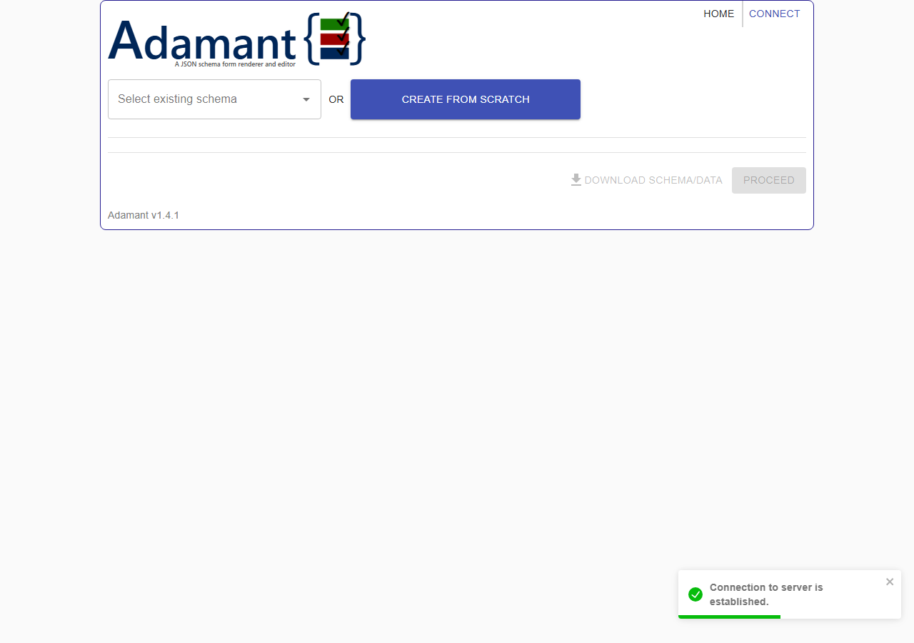

| Element | What it does |
|---|---|
| **Select existing schema** (dropdown) | Opens the schema selector — built-in schemas, a local file, a URL, or schemas from a connected NextCloud/eLabFTW account. See [Section 2](#2-loading-a-schema). |
| **CREATE FROM SCRATCH** | Starts with a completely empty schema that you build yourself inside the app. |
| **HOME** (top right) | Reloads the page and discards the current schema. |
| **CONNECT** (top right) | Opens the menu to connect NextCloud or eLabFTW accounts. See [Section 10](#10-connecting-external-services). |

A green **"Connection to server is established"** notification in the bottom-right corner means Adamant reached its back-end API — this enables the full built-in schema list and the NextCloud/eLabFTW integrations. If you don't see it, Adamant is running in offline mode; everything except connecting to NextCloud/eLabFTW still works, including uploading your own schema files.

---

## 2. Loading a Schema

### 2.1 The Schema Selector

Click the **Select existing schema** dropdown. It organizes every way of getting a schema into one searchable list, grouped by source:

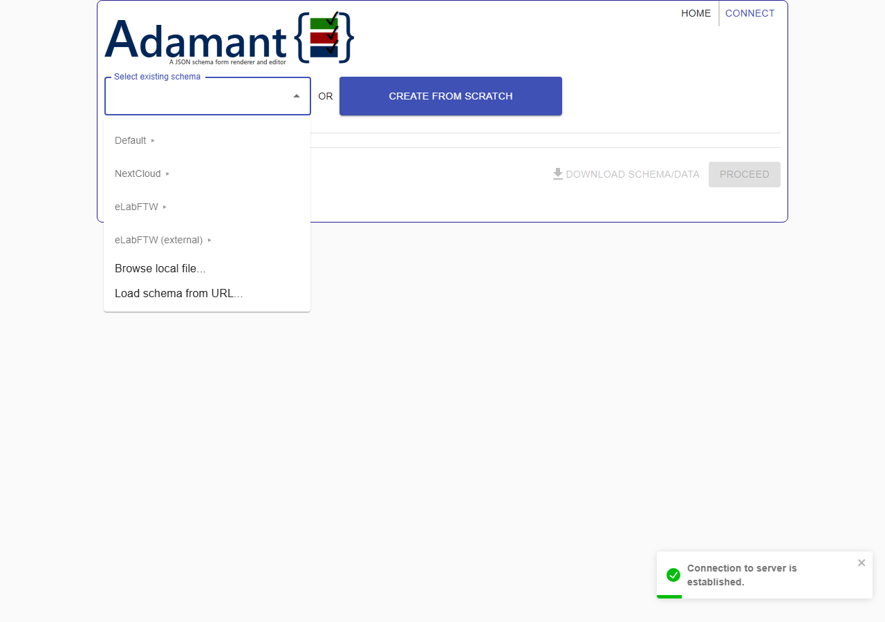

| Group | Contents |
|---|---|
| **Default** | The schemas bundled with (or served by) Adamant. Hover the group to expand it. |
| **NextCloud** | Schemas from your connected NextCloud folder, plus a "Browse NextCloud…" action. Grayed out until you connect. |
| **eLabFTW** | Schemas from your institution's connected eLabFTW account, plus a "Browse eLabFTW…" action. Grayed out until you connect. |
| **eLabFTW (external)** | A "Browse eLabFTW (external)…" action for a separate, custom eLabFTW instance you connect yourself. Grayed out until you connect. |
| **Browse** | Two always-available actions: **Browse local file…** and **Load schema from URL…**. |

You can also just type — the box filters across every group as you go.

### 2.2 Built-in Schemas

Hover **Default** to expand its list, then click a schema name to load it.

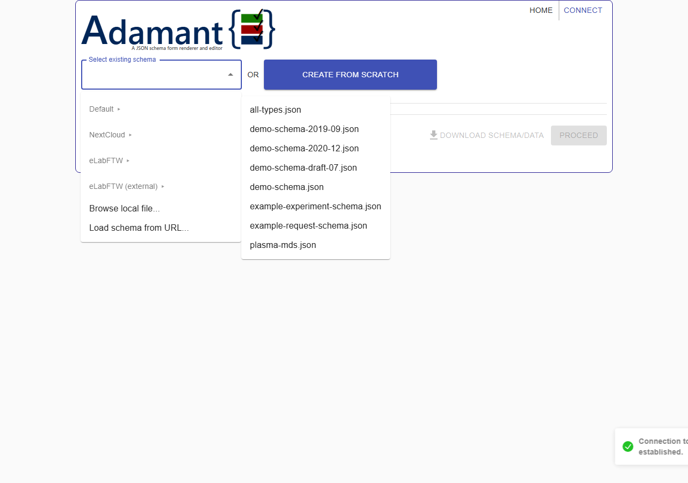

The list comes from Adamant's back-end (`backend/schemas/`) when a server connection is available, or from the schemas bundled into the browser app otherwise. Either way you get the same demo schemas, useful for exploring what Adamant can do.

> **Deploying your own schemas?**
> - **Server / Docker deployment** — drop `.json` files into `backend/schemas/` at the root of the repository. No restart needed if that folder is a mounted Docker volume (the default `docker-compose.yml` setup); otherwise restart the back-end container.
> - **Offline/bundled fallback** — the schemas baked into the browser app live in `src/schemas/`. Add files there and update the schema-name list in `src/pages/AdamantMain.jsx`, then rebuild (`npm run build`).

### 2.3 Browsing a Local File

Open the schema selector and click **Browse local file…**. Your operating system's file picker opens; choose a `.json` file containing a valid JSON Schema. If the file is invalid, Adamant shows a validation message instead of rendering a form.

### 2.4 Loading a Schema from a URL

Open the schema selector and click **Load schema from URL…**.

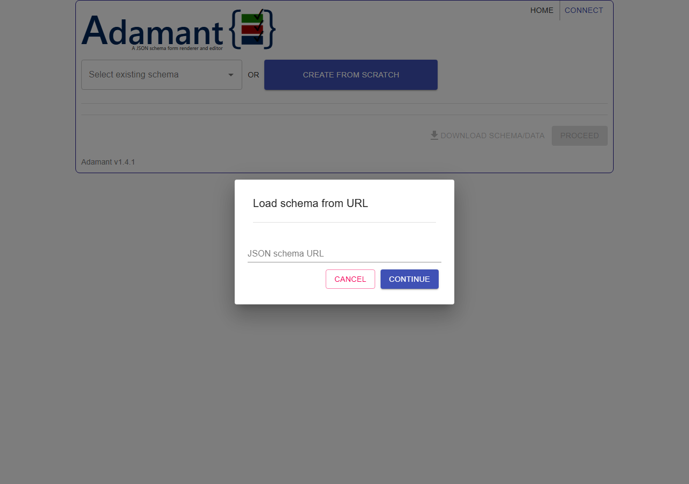

Paste the direct URL to a `.json` schema file and click **Continue**. Adamant fetches it through the back-end and renders the form — handy for sharing a schema by link instead of a file attachment.

### 2.5 Loading from NextCloud or eLabFTW

Once you're connected to NextCloud and/or eLabFTW (see [Section 10](#10-connecting-external-services)), their groups in the schema selector become active — hovering them reveals recently-seen schema names plus a **Browse…** action that opens a folder/item picker for that service.

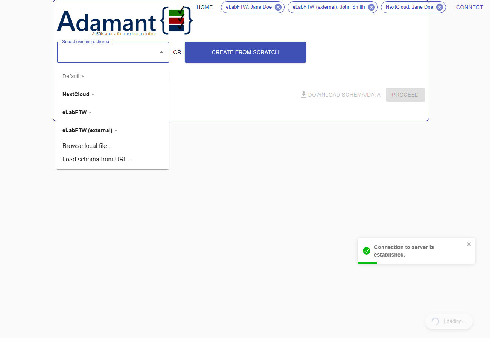

### 2.6 Creating a Schema from Scratch

Click **CREATE FROM SCRATCH**. Adamant creates an empty schema object and turns Edit Mode on automatically so you can start adding fields right away.

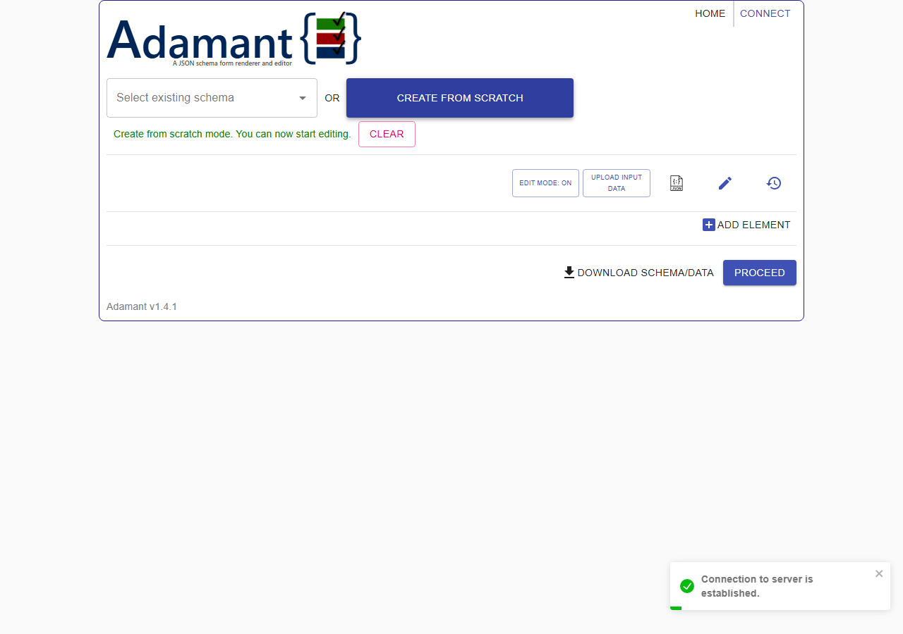

A green banner confirms *"Create from scratch mode. You can now start editing."* Click **CLEAR** to discard everything and start over. See [Section 5.2](#52-adding-a-new-field) for how to add fields.

---

## 3. The Form Interface

Once a schema is loaded, Adamant renders it as an interactive form: each field becomes a labelled input, and required fields are marked with an asterisk (*).

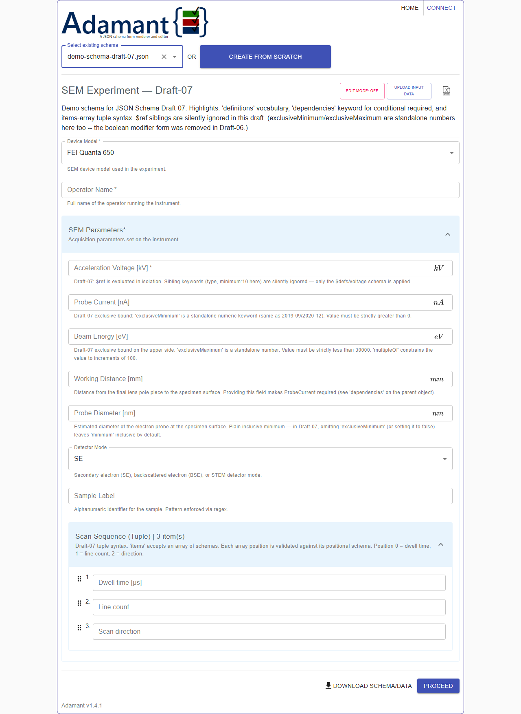

**What you see in normal (non-edit) mode:**

- **Field label** — the human-readable name, from the schema's `title` keyword.
- **Input widget** — a text box, number input, dropdown (`enum` fields), checkbox (`boolean`), or collapsible section (`object`/`array` types). Units placed in square brackets in a field's title (e.g. `Acceleration Voltage [kV]`) are shown as a subtle suffix inside the input.
- **Helper text** — a description below each input, from the schema's `description` keyword.
- **Schema header** — the schema's title, description, and a row of action buttons (edit mode toggle, upload input data, JSON viewer icon), covered in the next sections.
- **Bottom bar** — **Download Schema/Data** and **Proceed**, covered in [Sections 8](#8-downloading-your-work) and [9](#9-reviewing-and-submitting-a-form).

---

## 4. Viewing the Raw JSON Schema

The small `{}` icon button in the schema header opens the **JSON Schema Viewer** — a read-only view of the raw JSON Schema behind the current form.

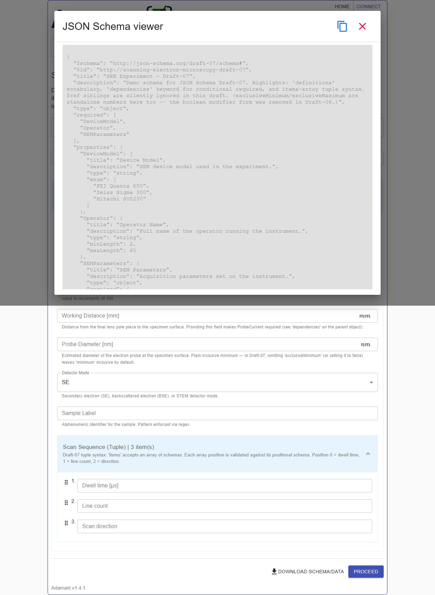

Use it to check the exact keywords on a field, inspect `$defs`/`definitions`, verify the `$schema` URI, or copy the raw schema text via the copy-to-clipboard button.

---

## 5. Edit Mode

Edit Mode lets you change the schema's structure — rename fields, add or remove them, change data types, adjust validation constraints. It does **not** touch the data you've already filled in.

Click **EDIT MODE: OFF** in the schema header to turn it on; it switches to **EDIT MODE: ON**.

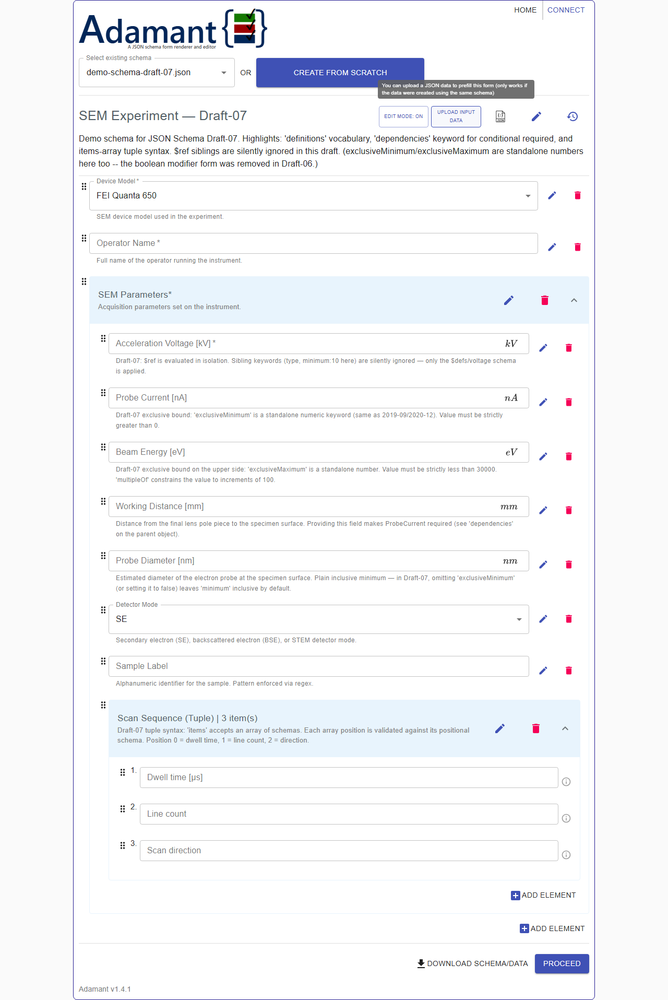

With Edit Mode on, every field gets a **pencil** (edit) and **bin** (delete) icon, and a **six-dot drag handle** appears on its left for reordering. Two extra icons appear next to the JSON viewer: a **pencil** to edit the schema header, and a **clock/revert** icon to undo all edits. An **+ ADD ELEMENT** button appears at the bottom of the form and of every object section.

### 5.1 Editing a Field

Click the pencil next to any field to open its editor.

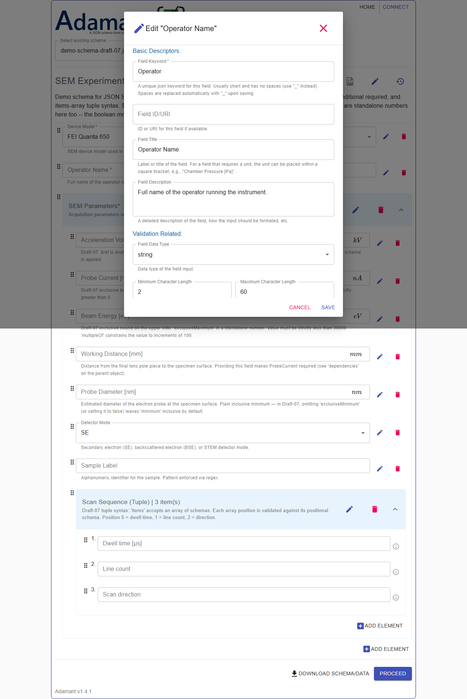

The dialog has two sections. **Basic Descriptors** covers identity and labelling:

| Field | Controls |
|---|---|
| Field Keyword | The JSON property key used in the schema and the output data. |
| Field ID/URI | An optional `$id` for the field. |
| Field Title | The human-readable label shown in the form. |
| Field Description | Helper text shown below the input. |

**Validation Related** adapts to the chosen **Field Data Type** — see [Section 11](#11-field-types-reference) for the full set of constraints available per type (min/max, pattern, format, enum, tuple items, and so on). A **Required** checkbox is available for every type.

Click **SAVE** to apply, **CANCEL** to discard.

### 5.2 Adding a New Field

Scroll to the bottom of the form (or of an object sub-section) and click **+ ADD ELEMENT**.

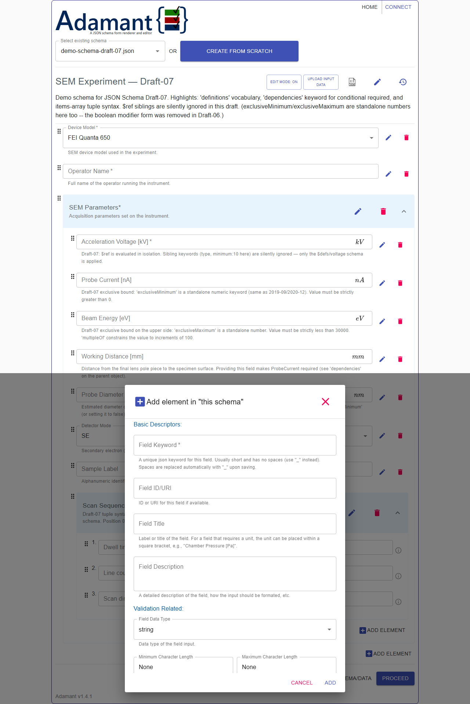

Fill in the Field Keyword (required), optionally a title and description, then choose the **Field Data Type**:

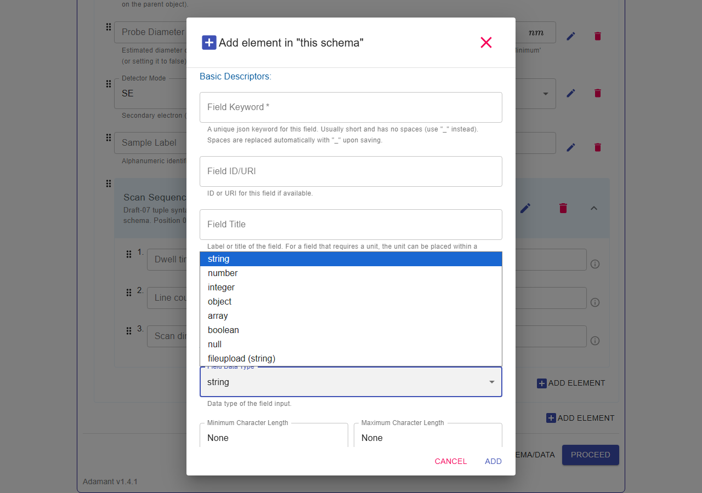

| Type | Notes |
|---|---|
| `string` | Optional min/max length, regex pattern, semantic format (email, date-time, uri, uuid, …), or an enumerated list of fixed choices. |
| `number` / `integer` | Min/max, exclusive min/max, and a "multiple of" constraint. |
| `object` | Creates a collapsible sub-section with its own nested fields. |
| `array` | A repeatable list; enable **Tuple array** to give each position its own fixed type instead. |
| `boolean` | A checkbox. |
| `null` | A field whose only valid value is `null`. |
| `fileupload (string)` | An Adamant-specific extension: renders a file picker whose selected file is stored as a string value. |

Set any validation constraints and click **ADD**.

### 5.3 Deleting a Field

Click the **bin** icon next to a field. It's removed immediately. This can't be undone field-by-field — use the revert icon ([5.6](#56-undoing-your-changes)) to roll back everything at once.

### 5.4 Reordering Fields

Grab the **six-dot handle** on the left of a field and drag it up or down. The schema's property order updates to match.

### 5.5 Editing the Schema Header

The pencil icon next to the JSON viewer icon (visible only in Edit Mode) opens the schema-level editor — title, description, ID, and specification version, not any individual field.

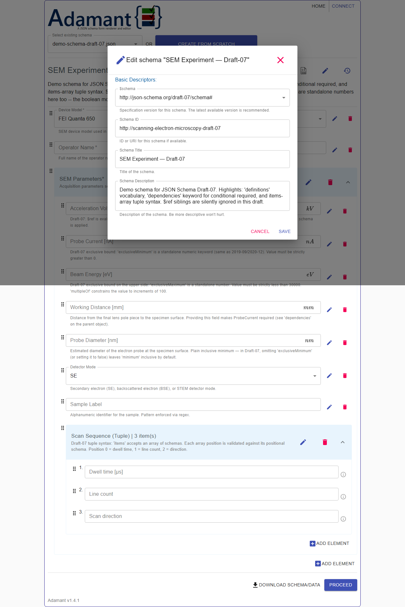

| Field | Controls |
|---|---|
| **$schema** | The JSON Schema specification version. See [Section 6](#6-supported-json-schema-specifications). |
| **Schema ID** | The `$id` URI for the schema as a whole. |
| **Schema Title** | The title shown at the top of the form. |
| **Schema Description** | The description shown below the title. |

Click **SAVE** or **CANCEL**.

### 5.6 Undoing Your Changes

Click the **clock/revert icon** in the schema header (visible when Edit Mode is on) to roll back every edit made during the current session, restoring the originally-loaded schema.

---

## 6. Supported JSON Schema Specifications

Adamant supports four JSON Schema specification versions ("dialects"), selectable from the **$schema** dropdown inside the schema-header editor:

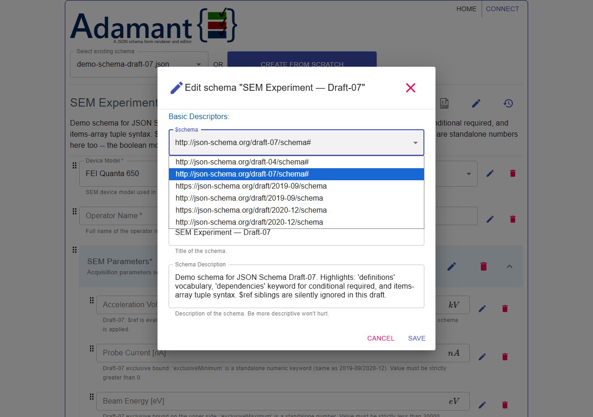

| Dialect | `$schema` URI |
|---|---|
| **Draft-04** | `http://json-schema.org/draft-04/schema#` |
| **Draft-07** | `http://json-schema.org/draft-07/schema#` |
| **Draft 2019-09** | `https://json-schema.org/draft/2019-09/schema` (or the equivalent `http://` URI) |
| **Draft 2020-12** | `https://json-schema.org/draft/2020-12/schema` (or the equivalent `http://` URI) |

Adamant validates each schema and its form data against the rules of whichever dialect its `$schema` URI declares, and flags schemas that use a keyword their declared dialect doesn't support. The three most commonly used are compared below (Draft-04 predates most of this and is supported mainly for legacy schemas).

**Draft-07**
- `definitions` for reusable sub-schemas.
- `$ref` siblings are silently ignored — only the referenced schema applies.
- `exclusiveMinimum`/`exclusiveMaximum` are standalone numbers (this changed from Draft-04's boolean-modifier form back in Draft-06, and hasn't changed since).
- `dependencies` for conditional required fields.
- Tuple arrays use `items` as an array of schemas.

**Draft 2019-09**
- `$defs` replaces `definitions` (both are still accepted).
- `$ref` siblings are honoured — the referenced schema and any sibling keywords are merged together.
- `dependencies` splits into `dependentRequired` and `dependentSchemas`.
- `unevaluatedProperties` is introduced, for closing an object built out of `allOf`/`anyOf`/`oneOf`.
- Tuple arrays still use `items` as an array, same as Draft-07.

**Draft 2020-12**
- Same `$ref`-sibling and `$defs`/`dependentRequired` behaviour as 2019-09.
- Tuple arrays switch to `prefixItems`; `items` now only constrains elements *beyond* the tuple.

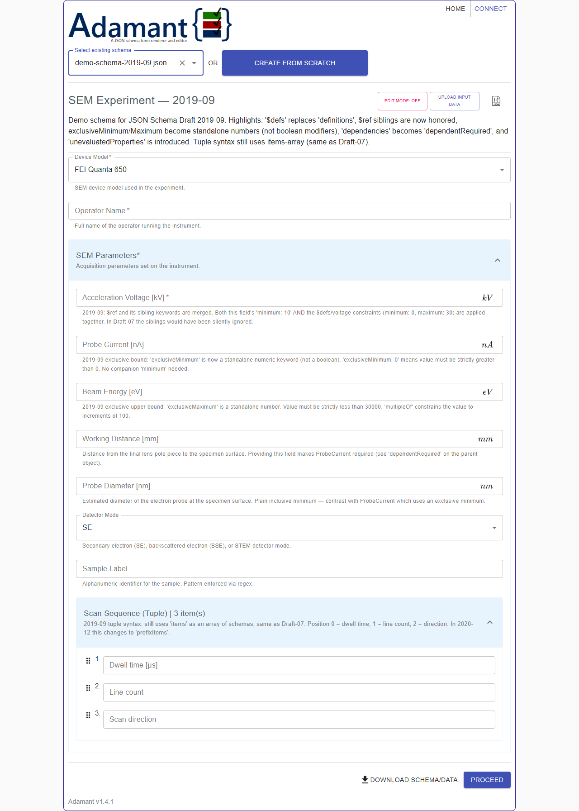

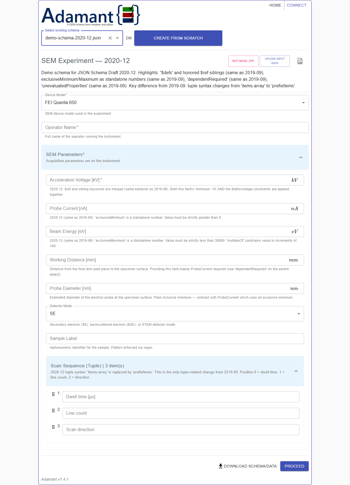

Switching the `$schema` dropdown to a different dialect does not automatically rewrite your schema's keywords for you — pick the dialect that matches how the schema is actually written, or update the keywords yourself to match the dialect you choose.

---

## 7. Uploading Pre-filled Data

To reload form data saved from an earlier session, click **upload input data** in the schema header.

| Option | Source |
|---|---|
| **Local file** | Always available — pick a `.json` data file from your computer. |
| **NextCloud** | Pick a data file from your connected NextCloud folder. |
| **eLabFTW** / **eLabFTW (external)** | Pick a data file attached to an eLabFTW experiment. |

The service options are disabled until you connect that service (see [Section 10](#10-connecting-external-services)); once connected they light up:

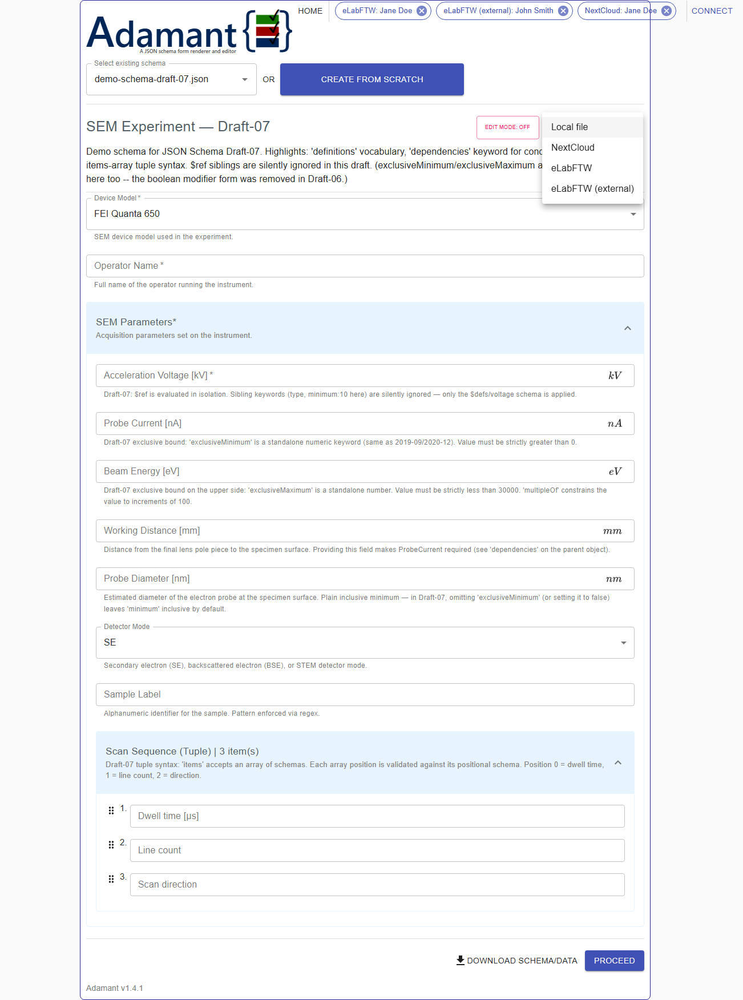

The data must have been created with the *same* schema — matching fields are filled in; anything else is ignored.

---

## 8. Downloading Your Work

Click **Download Schema/Data** at the bottom of the form.

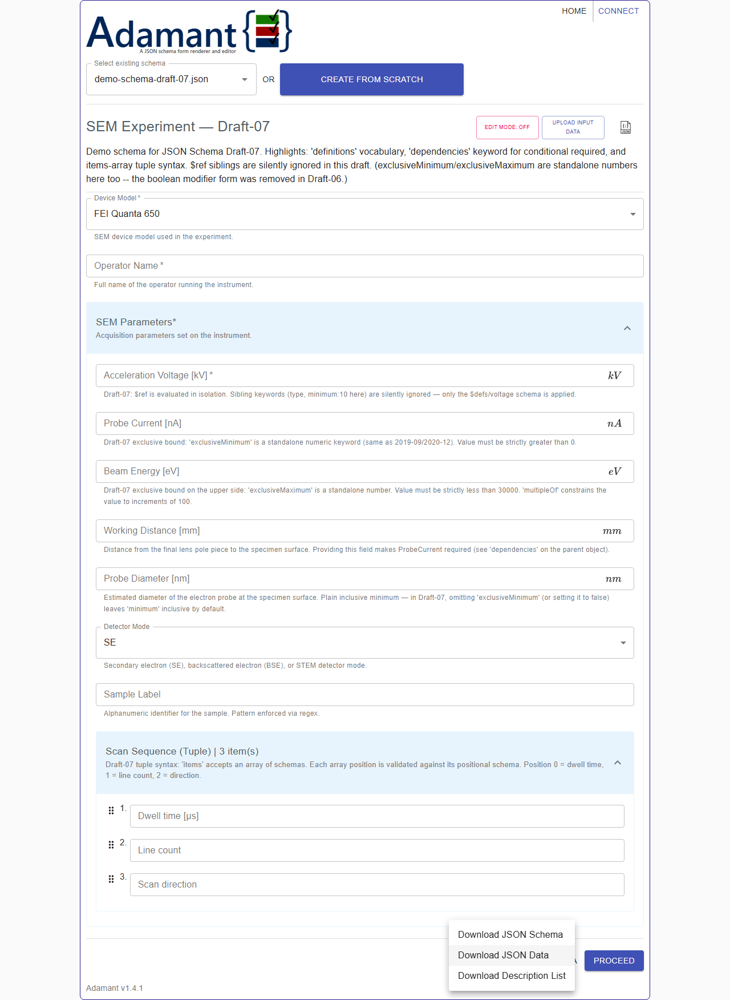

| Option | What you get |
|---|---|
| **Download JSON Schema** | The current schema, including any Edit Mode changes, as a `.json` file. |
| **Download JSON Data** | The data you filled in, as a `.json` file — reload it later with **Upload Input Data**. |
| **Download Description List** | An HTML-formatted summary of every field and its value, handy for pasting into lab notebooks or reports. |

---

## 9. Reviewing and Submitting a Form

When you're ready, click **Proceed** at the bottom right.

Adamant validates the form data against the schema first. Missing required fields or constraint violations are marked inline in red and summarized in a toast:

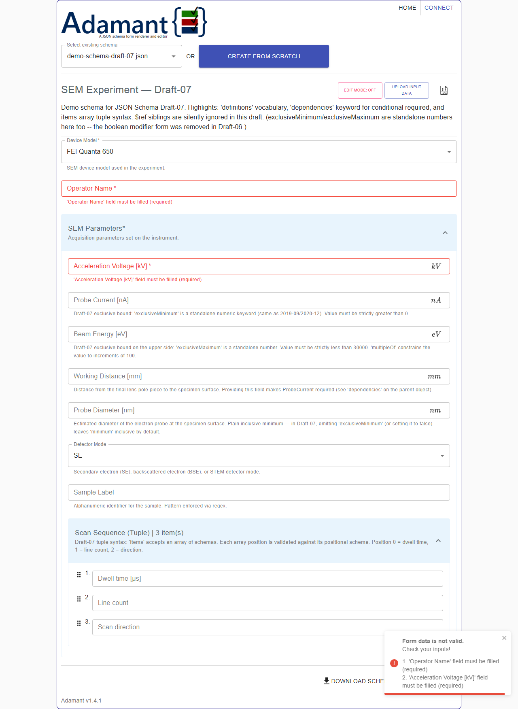

Fix the highlighted fields and click **Proceed** again. Once everything validates, the **Form review and submission** dialog opens with a full summary table of every field and value:

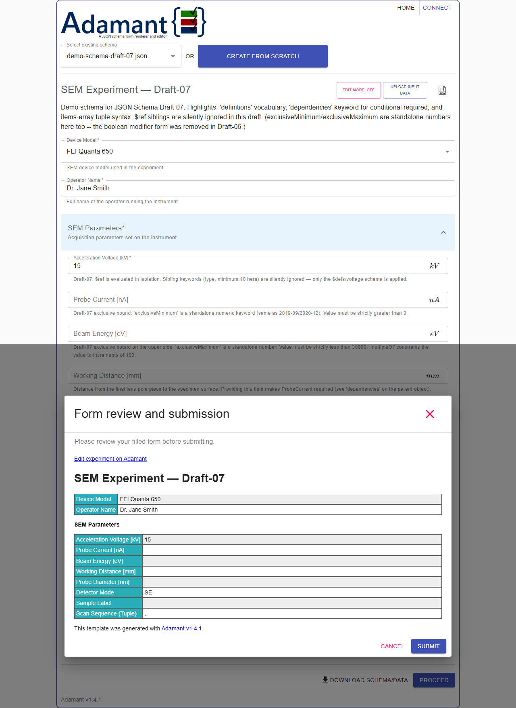

- Click **CANCEL** to go back and make corrections.
- Click **SUBMIT** to continue — depending on how Adamant is configured and which services you're connected to, you may be offered options such as creating an eLabFTW experiment or uploading the dataset to NextCloud.

---

## 10. Connecting External Services

Click **CONNECT** in the top-right corner to open the connection menu.

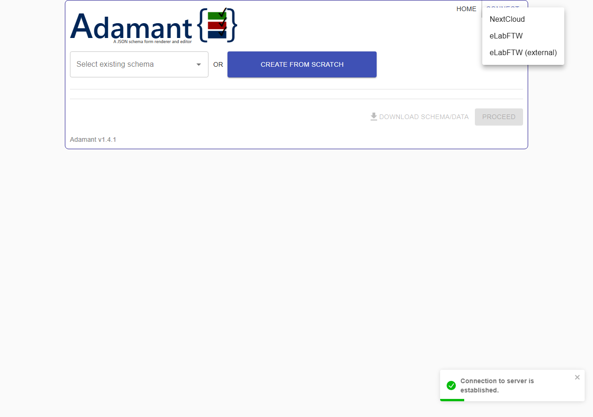

Each option is disabled once you're already connected to that service, and stays open in a chip in the top bar showing who you're connected as:

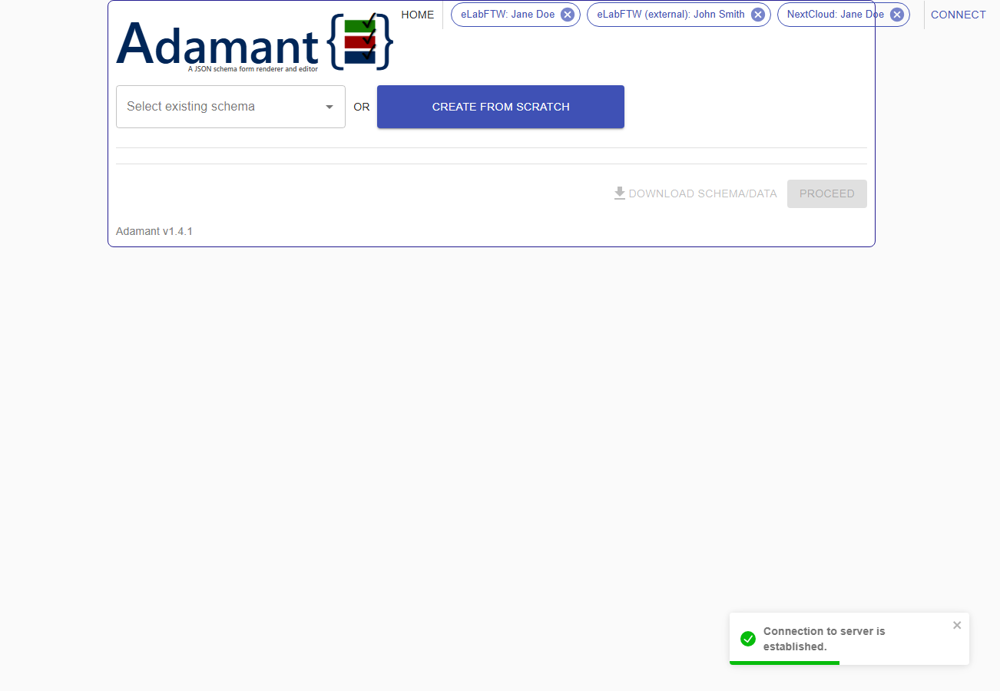

Click the **×** on a chip to disconnect.

### 10.1 eLabFTW (Your Institution's Instance)

Click **eLabFTW**.

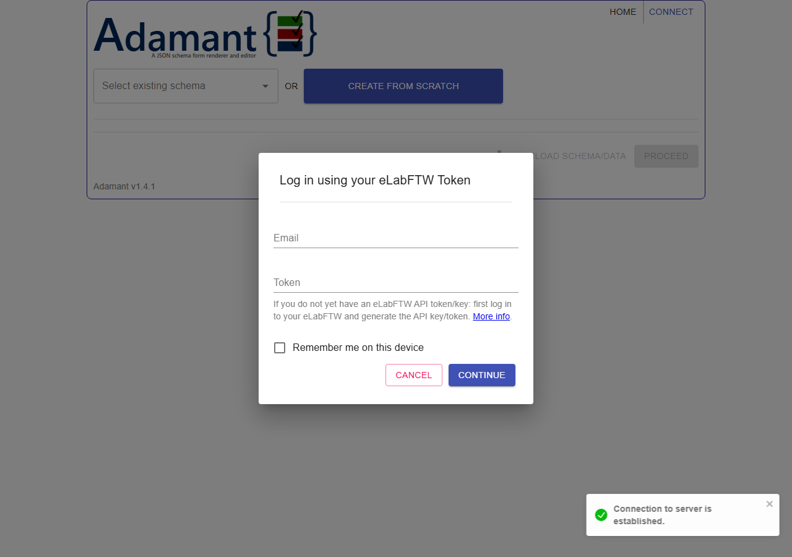

The server URL is pre-configured by whoever deployed Adamant for your institution — you only enter your **email** and your **eLabFTW API token** (generate one from your eLabFTW profile under *API keys*; see the *More info* link in the dialog). Click **CONTINUE**.

### 10.2 eLabFTW (External Instance)

Click **eLabFTW (external)** to connect a *different* eLabFTW instance than the one your institution pre-configured — useful for collaborating with another lab.

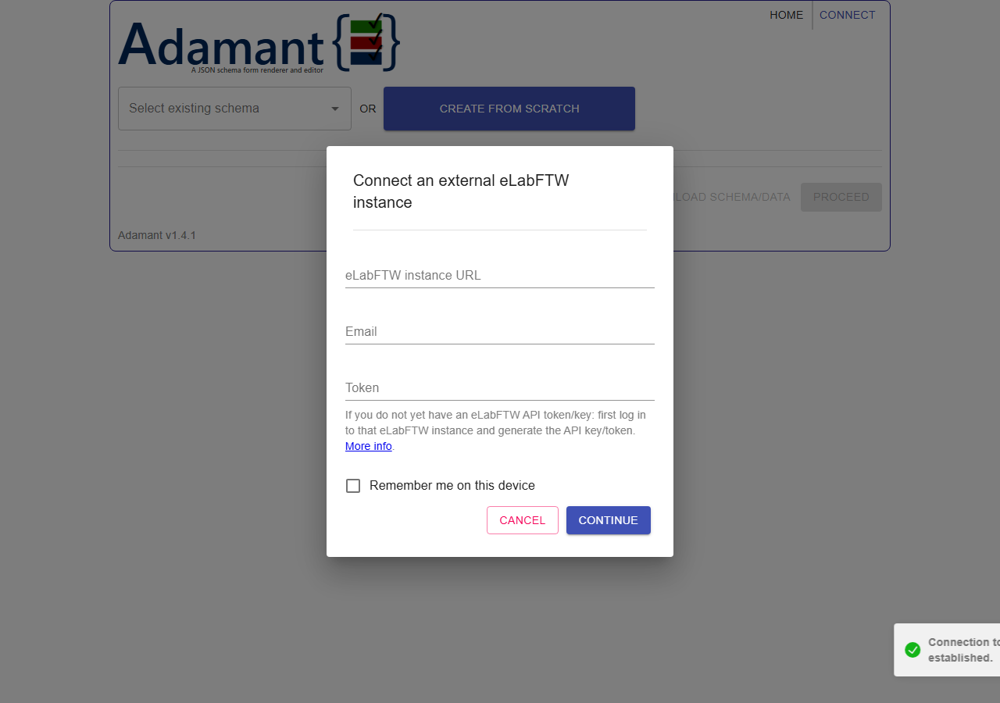

Enter the instance's URL, your email, and your API token for that instance, then **CONTINUE**.

### 10.3 NextCloud

Click **NextCloud**.

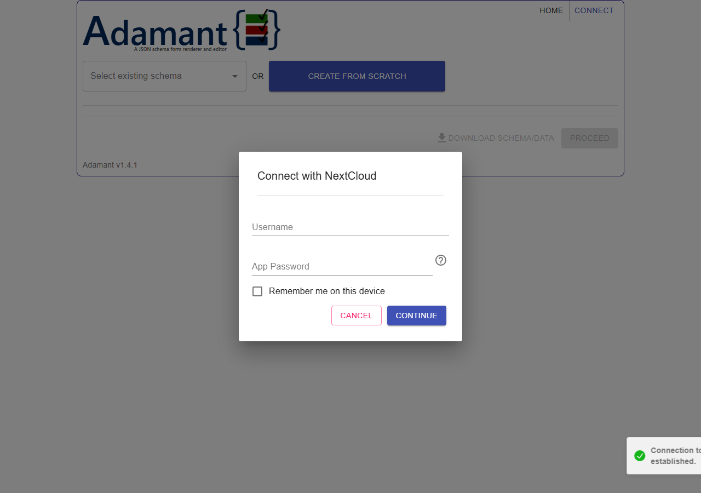

Like eLabFTW, the server URL is pre-configured by your institution. Enter your NextCloud **username** and an **app password** (not your account password) — generate one in NextCloud under *Settings → Security → Devices & sessions*, name it (e.g. "Adamant"), and click *Create new app password*. Click **CONTINUE**.

### 10.4 Remember Me

Every connection dialog has a **"Remember me on this device"** checkbox.

- **Unchecked (default)** — your login is kept only for the current browser session (it survives page reloads, but is cleared when the browser closes).
- **Checked** — your login is kept in the browser's local storage and survives closing and reopening the browser, until you disconnect or uncheck it on a later login.

What's stored is always a revocable, scoped credential (an eLabFTW API token or a NextCloud app password), never your account password — so you can invalidate access at any time from that service's own security settings, regardless of what Adamant has stored locally. Logging out only ends the active connection; it does not erase a remembered username/token, so reconnecting later is a single click rather than retyping everything.

### 10.5 Disconnecting

Click the **×** on a service's chip in the top bar, or reopen its dialog — logging out clears the active connection but, per [10.4](#104-remember-me), keeps a remembered login ready for next time.

---

## 11. Field Types Reference

| Type | Rendered as | Key validation options |
|---|---|---|
| `string` | Text box (or dropdown if enumerated) | Min/max length, regex pattern, semantic format (`email`, `date-time`, `uri`, `uuid`, …), enumerated list |
| `number` | Text box | Minimum/maximum, exclusive minimum/maximum, multiple of |
| `integer` | Text box | Same as `number`, integer values only |
| `boolean` | Checkbox | — |
| `null` | — | Only valid value is `null` |
| `object` | Collapsible section | Nested fields, each independently required/optional |
| `array` | Repeatable list, or a fixed-position tuple | Min/max items, unique items; tuple mode gives each position its own type |
| `fileupload (string)` | File picker | Adamant-specific; stores the selected file as a string value |

Every type also has a **Required** checkbox, and every field can carry a **Field Description** shown as helper text under the input.

---

## 12. Frequently Asked Questions

**Can I use Adamant without a server?**

Yes. Adamant runs entirely in the browser with no back-end required for form-filling and editing. Without a server connection the built-in schema list is limited to what's bundled into the app, and NextCloud/eLabFTW connections aren't available — everything else, including **Browse local file…**, works the same.

**How do I save my work and come back later?**

Use **Download JSON Data** ([Section 8](#8-downloading-your-work)). Next time you open the same schema, use **Upload Input Data → Local file** ([Section 7](#7-uploading-pre-filled-data)) to restore your entries.

**Can I add fields that aren't in the original schema?**

Yes, with Edit Mode on: click **+ ADD ELEMENT** wherever you want the new field. See [Section 5.2](#52-adding-a-new-field).

**I made a mess in Edit Mode. Can I undo everything?**

Click the clock/revert icon in the schema header (visible while Edit Mode is on) — see [Section 5.6](#56-undoing-your-changes).

**Which field types does Adamant support?**

`string`, `number`, `integer`, `object`, `array`, `boolean`, `null`, and the Adamant-specific `fileupload (string)`. See [Section 11](#11-field-types-reference).

**My schema uses `$ref`. Will Adamant handle it?**

For references within the same document (`#/$defs/...`, `#/definitions/...`), yes — Adamant resolves and renders them, and merges sibling keywords for 2019-09/2020-12 schemas as the spec requires (ignoring them for Draft-07, also per spec). References to *external* documents (a `$ref` pointing at a separate URL or file) are not resolved.

**Is "Remember me" safe to use?**

See [Section 10.4](#104-remember-me). It only ever stores a revocable API token or app password — never your account password — and is opt-in per connection.

**I see "Connection to server is established" in a green notification. What does that mean?**

Adamant reached its back-end API, which provides the full built-in schema list and enables NextCloud/eLabFTW integration. Without it you're in offline mode; everything except those integrations still works.

**How do I cite Adamant?**

Please cite the accompanying article:

> Chaerony Siffa, I., Schäfer, J., & Becker, M. M. (2022). Adamant: a JSON schema-based metadata editor for research data management workflows [version 2; peer review: 3 approved]. *F1000Research*, 11, 475. https://doi.org/10.12688/f1000research.110875.2
